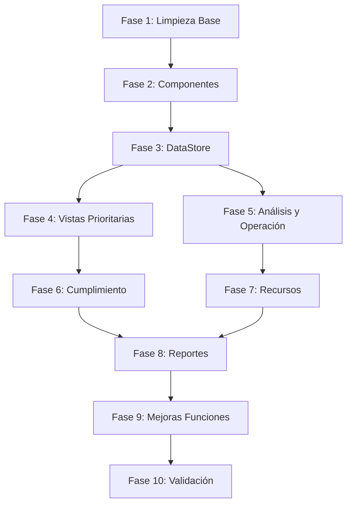

# Plan de Migración y Mejora: mockup_final.html → Nueva Arquitectura

## Estado Actual

### Vistas Completadas en index.html (9/28)

- Dashboard (parcial - tiene emojis)
- Datos Maestros (completa)
- BIA (básica)
- RIA (básica)
- BCP (básica)
- Incidentes (básica)
- Pruebas (básica)
- Auditoría (básica)
- Hallazgos (básica)
- Aprendizajes (básica)
- Cambios BCMS (básica)

### Vistas Pendientes (17/28)

- Normativas & Plantillas
- Proveedores & Terceros Críticos
- Configuración del Sistema
- Usuarios & Accesos
- Gobierno (Políticas & Estrategias)
- Riesgos Ciber
- Vista Integrada (BIA + RIA + Ciber)
- Biblioteca Normativa
- Controles & Cumplimiento
- Recursos & Capacidades
- DRP (Planes de Recuperación TI)
- Crisis
- Comunicaciones de Crisis
- Capacitación & Concienciación
- Reportes Ejecutivos
- Flujo (referencia interna)
- Catálogos (interna)

### Problemas Detectados

1. **Emojis en código**: Dashboard y varias vistas usan emojis (❌ prohibido)
2. **Datos estáticos**: Algunas vistas tienen datos hardcodeados en vez de usar datastore
3. **Falta de comentarios**: Las vistas no tienen delimitadores `<!-- INICIO VISTA -->`
4. **Código duplicado**: Tablas repetidas sin usar DynamicTable
5. **Gráficos incompletos**: Faltan gráficos en dashboard secundarios

---

## Fase 1: Limpieza y Estructura Base

### 1.1 Eliminar Emojis del Dashboard

**Archivo**: [`mockup_v2/index.html`](mockup_v2/index.html)

Reemplazar todos los emojis por íconos de Font Awesome:

- `📊` → `<i class="fa-solid fa-chart-line"></i>`
- `📈` → `<i class="fa-solid fa-chart-area"></i>`
- `🔥` → `<i class="fa-solid fa-fire"></i>`
- `⚠️` → `<i class="fa-solid fa-triangle-exclamation"></i>`
- `✅` → `<i class="fa-solid fa-circle-check"></i>`
- `⚡` → `<i class="fa-solid fa-bolt"></i>`
- `🗺️` → `<i class="fa-solid fa-map"></i>`

Buscar todos en: líneas 1010-2200 (Dashboard), líneas 1023-1041 (KPI cards)

### 1.2 Agregar Comentarios de Delimitación

**Archivo**: [`mockup_v2/index.html`](mockup_v2/index.html)

Para cada vista, agregar:

```html
<!-- INICIO VISTA: Dashboard -->
<div class="view active" id="view-dashboard">
  ...
</div>
<!-- FIN VISTA: Dashboard -->
```

Aplicar a las 25 vistas existentes (líneas 179-3973).

### 1.3 Agregar Comentarios de Componentes

Dentro de vistas complejas (Dashboard, Datos Maestros), agregar:

```html
<!-- Inicio - Dashboard: Gráficos Chart.js -->
...
<!-- Fin - Dashboard: Gráficos Chart.js -->
```

---

## Fase 2: Componentes Reutilizables

### 2.1 Crear Componente de KPI Cards

**Archivo nuevo**: [`mockup_v2/js/components/KPICard.js`](mockup_v2/js/components/KPICard.js)

Componente para renderizar tarjetas KPI dinámicas:

```javascript
class KPICard {
  constructor(config) {
    // label, value, subtitle, icon, color
  }
  render() { ... }
}
```

Usado en: Dashboard, Gobierno, Pruebas, Auditoría, etc.

### 2.2 Crear Componente de Matriz de Riesgo

**Archivo nuevo**: [`mockup_v2/js/components/RiskMatrix.js`](mockup_v2/js/components/RiskMatrix.js)

Componente para matriz 5x5 configurable:

```javascript
class RiskMatrix {
  constructor(containerId, risks, config) { ... }
  render() { ... }
  updateData(risks) { ... }
}
```

Usado en: Dashboard, RIA, Riesgos Ciber, Vista Integrada.

### 2.3 Crear Componente de Timeline

**Archivo nuevo**: [`mockup_v2/js/components/Timeline.js`](mockup_v2/js/components/Timeline.js)

Componente para líneas de tiempo (BIA, Incidentes, Crisis):

```javascript
class Timeline {
  constructor(containerId, events) { ... }
  render() { ... }
}
```

### 2.4 Crear Componente de Árbol Jerárquico

**Archivo nuevo**: [`mockup_v2/js/components/HierarchyTree.js`](mockup_v2/js/components/HierarchyTree.js)

Para navegación en Datos Maestros (Organización → Macroprocesos → Procesos):

```javascript
class HierarchyTree {
  constructor(containerId, data, config) { ... }
  render() { ... }
  onNodeClick(callback) { ... }
}
```

---

## Fase 3: Expansión del DataStore

### 3.1 Agregar Entidades Faltantes

**Archivo**: [`mockup_v2/js/datastore.js`](mockup_v2/js/datastore.js)

Agregar datos demo para:

**Proveedores & Terceros (línea ~800)**:

- `suppliers` (ya existe, expandir)
- `supplierContracts`
- `supplierAssessments`
- `supplierDependencies`

**Recursos & Capacidades (línea ~1200)**:

- `resourceInventory`
- `resourceCapacities`
- `resourceAllocations`

**Crisis (línea ~1400)**:

- `crisisDeclarations` (ya existe, expandir)
- `crisisActions`
- `crisisTeam`
- `crisisDecisions`

**Comunicaciones (línea ~1600)**:

- `communicationTemplates`
- `communicationLogs`
- `notificationChannels`

**Capacitación (línea ~1800)**:

- `trainingPrograms`
- `trainingRecords`
- `trainingCampaigns`

**Reportes (línea ~2000)**:

- `executiveReports`
- `reportSchedules`
- `reportDistribution`

### 3.2 Expandir Lookups

**Archivo**: [`mockup_v2/js/datastore.js`](mockup_v2/js/datastore.js) (líneas 35-200)

Agregar catálogos para:

- `supplierCriticality`
- `resourceTypes`
- `communicationChannels`
- `trainingTypes`
- `reportTypes`

---

## Fase 4: Migración de Vistas Prioritarias (Alta Complejidad)

### 4.1 Normativas & Plantillas

**Referencia**: [`mockup_v2/backup/mockup_final.html`](mockup_v2/backup/mockup_final.html) líneas 4012-4718

**Componentes**:

- Tabs: Editor / Biblioteca / Plantillas
- Galería de normativas (ISO 22301, ISO 27001, NIST CSF, etc.)
- Cards de plantillas descargables
- Filtros por jurisdicción
- Editor de frameworks personalizado

**Datos requeridos** (datastore.js):

- `complianceFrameworks` (ya existe, expandir)
- `requirementNodes` (ya existe)
- `documentTemplates` (agregar)

**Funciones** (functions.js):

- `renderNormativasView()`
- `showFrameworkEditor(frameworkId)`
- `importFramework(file)`

### 4.2 Proveedores & Terceros Críticos

**Referencia**: [`mockup_v2/backup/mockup_final.html`](mockup_v2/backup/mockup_final.html) líneas 11063-11692

**Componentes**:

- Dashboard TPRM (KPIs: Proveedores críticos, Contratos activos, Evaluaciones pendientes)
- Tabla con DynamicTable (criticidad, SLA, último assessment, acciones)
- Formulario de evaluación
- Dependencias con procesos críticos
- Planes de contingencia de proveedor

**Datos**: suppliers, supplierContracts, supplierAssessments

**Funciones**:

- `renderProveedoresView()`
- `openSupplierAssessment(supplierId)`
- `linkSupplierToProcess(supplierId, processId)`

### 4.3 Gobierno & Políticas

**Referencia**: [`mockup_v2/backup/mockup_final.html`](mockup_v2/backup/mockup_final.html) líneas 8984-9649

**Componentes**:

- Mini Dashboard (5 KPIs)
- Tabs: Contexto BCMS / Políticas / Objetivos / Roles / Revisión Dirección
- Documento de Alcance versionado
- Tabla de objetivos BCMS
- Matriz de roles y responsabilidades
- Actas de revisión por dirección

**Datos**:

- `bcmsContext` (agregar)
- `bcmsPolicies` (agregar)
- `bcmsObjectives` (agregar)
- `managementReviews` (agregar)

**Funciones**:

- `renderGobiernoView()`
- `showContextEditor()`
- `createManagementReview()`

### 4.4 Configuración del Sistema

**Referencia**: [`mockup_v2/backup/mockup_final.html`](mockup_v2/backup/mockup_final.html) líneas 12332-13127

**Componentes**:

- Tabs: Jurisdicción / Canales / Integraciones / Backups / Logs
- Configuración de reguladores por país
- Canales de comunicación (SMTP, SMS, Webhooks)
- Gestión de API keys
- Configuración de backups automáticos
- Logs de auditoría técnica

**Datos**:

- `systemConfig` (ya existe en config, expandir)
- `notificationChannels` (agregar)
- `apiIntegrations` (agregar)
- `auditLogs` (agregar)

**Funciones**:

- `renderConfiguracionView()`
- `testEmailChannel()`
- `testSMSChannel()`
- `exportBackup()`

---

## Fase 5: Vistas de Análisis y Operación

### 5.1 Riesgos Ciber

**Referencia**: [`mockup_v2/backup/mockup_final.html`](mockup_v2/backup/mockup_final.html) líneas 5907-6117

**Componentes**:

- Mini Dashboard (5 KPIs: Amenazas, Vulnerabilidades, Activos críticos, etc.)
- Tabla de riesgos ciber con DynamicTable
- Matriz de calor específica cyber
- Panel de amenazas y vulnerabilidades
- Vinculación con activos

**Datos**:

- `cyberRisks` (filtrar risks donde domain='CYBER')
- `threats` (ya existe)
- `vulnerabilities` (ya existe)
- `assetVulnerabilities` (ya existe)

**Usar componente**: RiskMatrix.js

### 5.2 Vista Integrada (BIA + RIA + Ciber)

**Referencia**: [`mockup_v2/backup/mockup_final.html`](mockup_v2/backup/mockup_final.html) líneas 6118-6221

**Componentes**:

- Bloque explicativo con CTAs
- Grid consolidado de procesos con:
  - Criticidad BIA
  - RTO/RPO
  - Riesgos de continuidad
  - Riesgos ciber
  - Planes asociados
- Filtros avanzados multi-dimensión
- Exportación a Excel

**Datos**: Consolidación de processes, biaData, risks, continuityPlans

**Funciones**:

- `renderVistaIntegradaView()`
- `exportIntegratedView()`

### 5.3 DRP (Planes de Recuperación TI)

**Referencia**: [`mockup_v2/backup/mockup_final.html`](mockup_v2/backup/mockup_final.html) líneas 6702-7122

**Componentes**:

- Dashboard DRP (5 KPIs)
- Lista de planes DRP con filtros
- Detalle de plan: Servicios de aplicación, Infraestructura, Procedimientos
- Criterios de activación
- Dependencias tecnológicas
- RTO/RPO por servicio

**Datos**:

- `continuityPlans` (filtrar por plan_type='DRP')
- `appServices` (agregar)
- `assets` (ya existe, expandir)
- `recoveryProcedures` (ya existe)

### 5.4 Crisis

**Referencia**: [`mockup_v2/backup/mockup_final.html`](mockup_v2/backup/mockup_final.html) líneas 7504-8022

**Componentes**:

- Semáforo de estado (Verde/Amarillo/Rojo)
- Dashboard crisis activas
- Comité de crisis (call tree)
- Timeline de decisiones
- Activación de planes BCP/DRP
- Bitácora de acciones

**Datos**: crisisDeclarations, crisisActions, callTrees, callTreeNodes

**Funciones**:

- `renderCrisisView()`
- `declararCrisis(nivel)`
- `activarPlan(planId)`
- `logCrisisAction(action)`

### 5.5 Comunicaciones de Crisis

**Referencia**: [`mockup_v2/backup/mockup_final.html`](mockup_v2/backup/mockup_final.html) líneas 8023-8229

**Componentes**:

- Panel de envío rápido
- Plantillas de comunicación
- Destinatarios por grupo
- Log de envíos
- Confirmaciones de lectura (simulado)

**Datos**: communicationTemplates, communicationLogs, contacts

---

## Fase 6: Vistas de Cumplimiento

### 6.1 Biblioteca Normativa

**Referencia**: [`mockup_v2/backup/mockup_final.html`](mockup_v2/backup/mockup_final.html) líneas 10052-10192

**Componentes**:

- Toolbar con selector de jurisdicción
- Galería de frameworks activos
- Tabla de requisitos por framework
- Detalle de requisito con controles mapeados
- Estado de cumplimiento por requisito

**Datos**: complianceFrameworks, requirementNodes, referenceControls

### 6.2 Controles & Cumplimiento

**Referencia**: [`mockup_v2/backup/mockup_final.html`](mockup_v2/backup/mockup_final.html) líneas 8231-8725

**Componentes**:

- Dashboard cumplimiento (% por framework)
- Matriz de aplicabilidad (requisitos vs controles)
- Tabla de evaluaciones
- Gestión de evidencias por control
- Gap analysis

**Datos**: referenceControls, complianceAssessments, requirementEvaluations, evidences

---

## Fase 7: Vistas de Recursos y Capacitación

### 7.1 Recursos & Capacidades

**Referencia**: [`mockup_v2/backup/mockup_final.html`](mockup_v2/backup/mockup_final.html) líneas 11694-12007

**Componentes**:

- Dashboard recursos (6 KPIs)
- Tabs: Personas / Sitios / TI / Inventario / Proveedores
- Capacidades disponibles vs requeridas
- Asignación a planes BCP/DRP
- Gaps de capacidad

**Datos**: resourceInventory, resourceCapacities, resourceAllocations

### 7.2 Capacitación & Concienciación

**Referencia**: [`mockup_v2/backup/mockup_final.html`](mockup_v2/backup/mockup_final.html) líneas 12008-12331

**Componentes**:

- KPIs capacitación
- Calendario de programas
- Tabla de personal con estado de capacitación
- Registro de asistencias
- Certificaciones

**Datos**: trainingPrograms, trainingRecords

---

## Fase 8: Reportes y Mejora Final

### 8.1 Reportes Ejecutivos

**Referencia**: [`mockup_v2/backup/mockup_final.html`](mockup_v2/backup/mockup_final.html) líneas 13129-13589

**Componentes**:

- Dashboard reportes (4 KPIs)
- Galería de reportes disponibles
- Preview de reportes
- Generación bajo demanda
- Programación de envíos
- Exportación PDF/Excel (simulado)

**Datos**: executiveReports, reportSchedules

### 8.2 Usuarios & Accesos

**Referencia**: [`mockup_v2/backup/mockup_final.html`](mockup_v2/backup/mockup_final.html) líneas 10768-11062

**Componentes**:

- Dashboard usuarios
- Tabla de usuarios con roles
- Gestión de permisos
- Registro de accesos (audit log)
- Invitaciones pendientes

**Datos**: userAccounts, roles, userRoles, auditLogs

---

## Fase 9: Mejoras de Funciones y Gráficos

### 9.1 Expandir charts.js

**Archivo**: [`mockup_v2/js/charts.js`](mockup_v2/js/charts.js)

Agregar gráficos faltantes del Dashboard:

- `chartPruebas` - Estado de Pruebas (ya existe, mejorar)
- `chartMTTR` - MTTR vs RTO (ya existe, mejorar)
- `chartCumplimiento` - % Cumplimiento por Framework (nuevo)
- `chartActivos` - Distribución de Activos (nuevo)

### 9.2 Agregar Funciones de Renderizado

**Archivo**: [`mockup_v2/js/functions.js`](mockup_v2/js/functions.js)

Crear funciones render para cada vista nueva:

- `renderNormativasView()`
- `renderProveedoresView()`
- `renderGobiernoView()`
- `renderConfiguracionView()`
- `renderRiesgosCiberView()`
- `renderVistaIntegradaView()`
- `renderDRPView()`
- `renderCrisisView()`
- `renderComunicacionesCrisisView()`
- `renderBibliotecaView()`
- `renderControlesView()`
- `renderRecursosView()`
- `renderCapacitacionView()`
- `renderReportesView()`
- `renderUsuariosView()`

### 9.3 Mejorar Funciones Existentes

**Archivo**: [`mockup_v2/js/functions.js`](mockup_v2/js/functions.js)

- Refactorizar `renderDashboard()` para usar componentes
- Mejorar `showView()` con transiciones suaves
- Agregar funciones de exportación (Excel, PDF simulado)

---

## Fase 10: Validación y Documentación

### 10.1 Validación de Emojis

Ejecutar búsqueda global para asegurar que no quedan emojis:

- Buscar regex: `[\u{1F300}-\u{1F9FF}]` en index.html
- Buscar unicode: `\u2600-\u26FF`, `\u2700-\u27BF`

### 10.2 Validación de Datos Estáticos

Verificar que todas las vistas usan `BCMSDataStore`:

- Grep por valores hardcodeados en tablas
- Verificar que todos los renders llaman `BCMSDataStore.api.get*()`

### 10.3 Actualizar Documentación

**Archivo**: [`mockup_v2/docs/analisis_vistas.md`](mockup_v2/docs/analisis_vistas.md)

- Actualizar con vistas migradas
- Documentar componentes creados
- Diagrama de flujo de datos

### 10.4 CSS Cleanup

**Archivo**: [`mockup_v2/css/styles.css`](mockup_v2/css/styles.css)

- Eliminar estilos no utilizados
- Consolidar clases duplicadas
- Verificar consistencia de variables CSS

---

## Priorización Sugerida

### Nivel 1 - Crítico (Semana 1-2)

1. Limpieza de emojis (Fase 1.1)
2. Comentarios de delimitación (Fase 1.2-1.3)
3. Componentes base (Fase 2.1-2.2)
4. DataStore expansión básica (Fase 3.1 parcial)

### Nivel 2 - Alto (Semana 3-4)

5. Normativas & Plantillas (Fase 4.1)
6. Proveedores (Fase 4.2)
7. Configuración (Fase 4.4)
8. DRP (Fase 5.3)

### Nivel 3 - Medio (Semana 5-6)

9. Gobierno (Fase 4.3)
10. Riesgos Ciber (Fase 5.1)
11. Vista Integrada (Fase 5.2)
12. Crisis (Fase 5.4)

### Nivel 4 - Complementario (Semana 7-8)

13. Biblioteca Normativa (Fase 6.1)
14. Controles & Cumplimiento (Fase 6.2)
15. Recursos & Capacidades (Fase 7.1)
16. Comunicaciones Crisis (Fase 5.5)

### Nivel 5 - Finales (Semana 9-10)

17. Capacitación (Fase 7.2)
18. Reportes (Fase 8.1)
19. Usuarios (Fase 8.2)
20. Validaciones y cleanup (Fase 10)

---

## Consideraciones Técnicas

### Compatibilidad con Schema v10

Todas las entidades agregadas al datastore deben alinearse con:

- [`mockup_v2/docs/BCMS_PostgreSQL_schema_v10.sql`](mockup_v2/docs/BCMS_PostgreSQL_schema_v10.sql), pero en caso de que algún tipo de dato sea necesario y no esté en el schema, preguntar por su inclusión en el `datastore.js` y explicar el porqué es necesario.
- Usar campos de auditoría: `created_at`, `updated_at`, `created_by`, etc.
- Respetar nomenclatura de tablas y relaciones

### Reutilización de Código

- Antes de crear nuevo código, verificar si existe en mockup_final.html
- Usar DynamicTable para todas las tablas nuevas
- Centralizar formularios modales en functions.js
- Evitar duplicación de estilos inline

### Performance

- Lazy loading de componentes pesados (Timeline, HierarchyTree)
- Paginación obligatoria en tablas >50 registros
- Debounce en filtros de búsqueda

---

## Diagrama de Dependencias



---

## Métricas de Éxito

- ✅ 0 emojis en código
- ✅ 28/28 vistas migradas y funcionales
- ✅ 100% de datos desde BCMSDataStore
- ✅ 4+ componentes reutilizables creados
- ✅ Todas las vistas con comentarios de delimitación
- ✅ Schema v10 compliance al 100%
- ✅ Sin código duplicado significativo